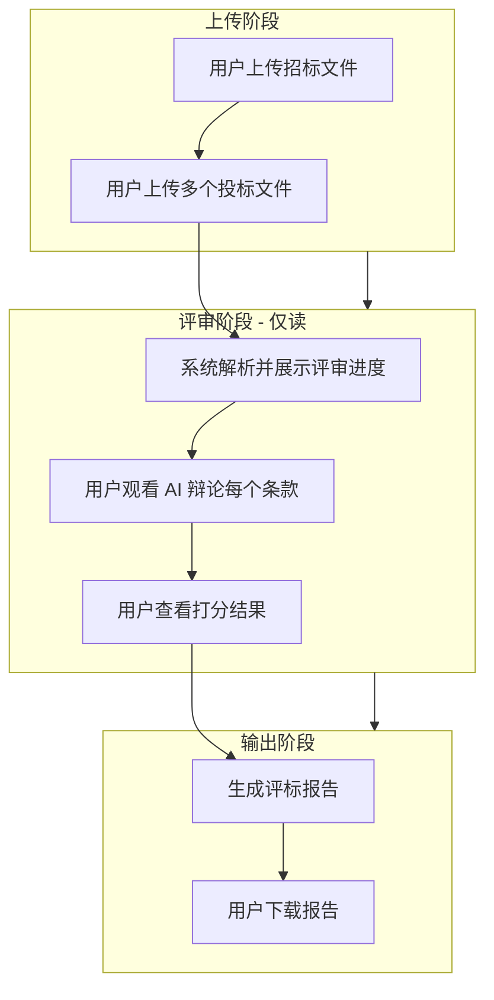
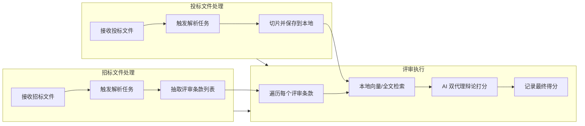
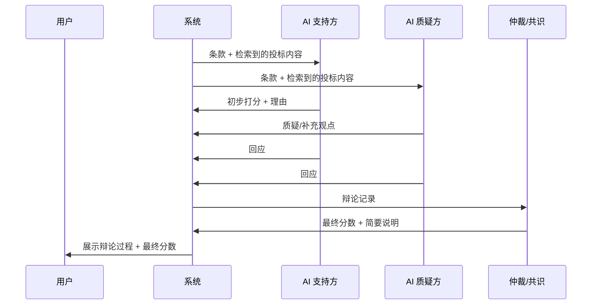
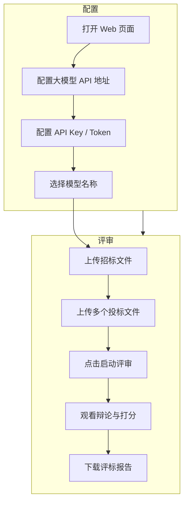
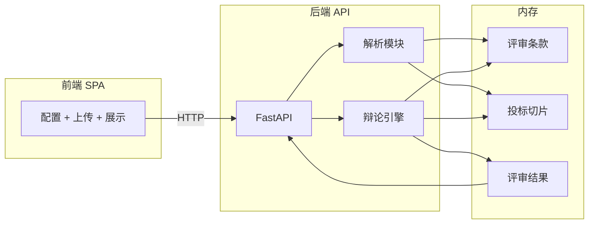

# Pingbiao-Power 前期规格说明书

## 1. 文档目标与范围

本文档为 Pingbiao-Power 评标系统的前期规格说明书，作为项目开发的指导文档。文档覆盖产品定位、用户流程、系统架构、核心功能、数据模型及技术选型建议。

---

## 2. 项目概述

- **项目名称**: Pingbiao-Power
- **产品定位**: 智能评标辅助系统，通过 AI 双代理辩论机制提升评标透明度与公正性
- **核心价值**: 自动化解析招标/投标文件，结构化评审条款，AI 辩论式打分增强用户对评审公平性的感知

---

## 3. 用户流程（User Flow）



- 用户仅负责：上传招标文件、上传投标文件、观看评审过程、下载报告
- 评审过程对用户为**只读**，不可干预打分

---

## 4. 后台流程（Backend Flow）



**关键流程说明**:

1. **招标文件解析**: 接收后异步触发解析，输出结构化评审条款（条款编号、描述、分值、权重等）
2. **投标文件解析**: 接收后异步解析，对每个投标文件进行切片（chunking），存入本地存储（便于后续 RAG 检索）
3. **条款评审**: 对每个条款，从本地检索相关投标切片，作为上下文供 AI 评审
4. **AI 双代理辩论**: 两个 AI 分别扮演「支持方」与「质疑方」，对每个条款的符合性进行辩论，最终达成或由仲裁逻辑得出分数

---

## 5. 核心功能模块

| 模块 | 职责 | 输入 | 输出 |
|------|------|------|------|
| 招标文件解析 | 解析 PDF，抽取评审条款 | 招标文件 | 评审条款列表 JSON |
| 投标文件解析 | 解析投标文件，切片存储 | 投标文件 | 本地切片库 + 元数据 |
| 检索服务 | 按条款检索相关投标内容 | 条款 + 投标 ID | 相关切片列表 |
| AI 辩论引擎 | 双代理辩论 + 打分 | 条款 + 检索结果 | 分数 + 辩论记录 |
| 报告生成 | 汇总评审结果 | 所有条款得分 | 评标报告 PDF/Word |

---

## 6. AI 双代理辩论机制（核心体验设计）



- **展示策略**: 辩论过程以流式或分步形式展示给用户，增强「公平公正」的感知
- **共识机制**: 可设计为多轮辩论 + 最终仲裁，或设定最大轮数后取加权平均

---

## 7. 数据模型（概要）

- **招标项目 (Project)**: id, 招标文件路径, 创建时间, 状态
- **评审条款 (Clause)**: id, project_id, 条款编号, 描述, 分值, 权重, 顺序
- **投标文件 (Bid)**: id, project_id, 文件名, 切片存储路径, 解析状态
- **投标切片 (BidChunk)**: id, bid_id, 内容, 向量(可选), 元数据
- **条款评审结果 (ClauseEvaluation)**: id, clause_id, bid_id, 分数, 辩论记录, 最终理由
- **评标报告 (Report)**: id, project_id, 报告路径, 生成时间

---

## 8. MVP 技术栈推荐（快速落地）

为快速跑出 MVP，采用轻量化架构：**无存储、无登录**，所有数据在单次会话内完成。

### 8.1 技术选型

| 层级 | 选型 | 说明 |
|------|------|------|
| 前端 | Vite + React + Tailwind CSS | 启动快、热更新好，适合快速迭代 |
| 后端 | Python + FastAPI | 异步支持、与 LLM 调用契合，开发效率高 |
| 文件解析 | PyMuPDF | 轻量，仅支持 PDF，无额外服务依赖 |
| 切片 | 纯内存 | 投标文件解析后切片存于内存，无需向量库 |
| 检索 | 关键词匹配 / 简单相似度 | MVP 阶段用 BM25 或关键词检索即可，无需 Embedding |
| LLM 调用 | openai Python SDK | 兼容 OpenAI、DeepSeek、Azure 等 OpenAI 兼容 API |
| 报告 | HTML 导出 | 生成 HTML 报告，浏览器打印为 PDF，或使用 weasyprint |

### 8.2 MVP 用户流程



- 大模型配置：API Base URL（可选，默认 `https://api.openai.com/v1`）、API Key、模型名称（如 `gpt-4o`、`deepseek-chat`）
- 配置保存在前端 localStorage，刷新后仍可用，无需后端存储

### 8.3 MVP 架构（无存储）



- 招标/投标文件上传后暂存为临时文件，解析完成后可删除
- 评审条款、投标切片、评审结果均存于内存，会话结束即释放

### 8.4 项目结构建议

```
pingbiao/
├── frontend/                 # Vite + React
│   ├── src/
│   │   ├── components/       # 配置表单、文件上传、辩论展示
│   │   ├── App.tsx
│   │   └── main.tsx
│   └── package.json
├── backend/                  # FastAPI
│   ├── main.py              # 入口、路由
│   ├── parser/              # 招标/投标解析
│   ├── debate/              # AI 双代理辩论
│   ├── report/              # 报告生成
│   └── requirements.txt
└── docs/
    └── pingbiao.md
```

### 8.5 核心依赖（MVP）

**后端 requirements.txt 示例**:
```
fastapi
uvicorn[standard]
python-multipart
pymupdf
openai
```

**前端 package.json 核心依赖**:
```
react, react-dom
vite
tailwindcss
```

---

## 9. 技术选型建议（完整版，后续迭代）

- **文件解析**: PyMuPDF（MVP 仅 PDF）/ Unstructured 等
- **切片与检索**: LangChain TextSplitter + 向量库（Chroma / Milvus / pgvector）或全文检索（Elasticsearch）
- **AI 辩论**: 多 Agent 框架（LangGraph / AutoGen / CrewAI）或自定义编排
- **存储**: 本地文件系统 + SQLite/PostgreSQL
- **前端**: 根据团队技术栈选择（React），需支持文件上传、进度展示、辩论过程展示、报告下载

---

## 10. 非功能需求

- **安全性**: 招标/投标文件本地存储，需考虑加密与访问控制
- **可扩展性**: 支持多种文件格式、多种评审条款模板
- **可观测性**: 解析与评审任务状态、耗时、错误日志

---

## 11. 实施建议

### MVP 路径（推荐优先）

1. **MVP Phase 1**: 前端配置页（LLM API URL、Key、模型）+ 文件上传 + 后端解析（招标条款 + 投标切片，内存存储）
2. **MVP Phase 2**: 单 AI 评审流程打通（条款 + 检索 → 打分），验证端到端
3. **MVP Phase 3**: 双 AI 辩论引擎 + 前端辩论流式展示
4. **MVP Phase 4**: HTML 报告生成 + 下载，完成可演示 MVP

### 完整版路径（后续迭代）

1. **Phase 1**: 招标文件解析 + 投标文件解析 + 持久化切片存储
2. **Phase 2**: 向量检索服务 + 单 AI 评审
3. **Phase 3**: AI 双代理辩论引擎 + 前端辩论展示
4. **Phase 4**: 报告生成 + 存储 + 登录 + 完整联调

---

## 12. MVP 开发实现指南（供 Claude Code 直接开发）

本节提供足够细的实现规格，使 AI 可直接据此开发 MVP，无需额外澄清。

### 12.1 开发环境与启动

- **Python**: 3.10+
- **Node**: 18+
- **后端启动**: `cd backend && uvicorn main:app --reload --port 8000`
- **前端启动**: `cd frontend && npm run dev`（默认端口 5173）
- **前端代理**: Vite 配置 `proxy: { '/api': 'http://localhost:8000' }`，前端请求统一走 `/api`

### 12.2 CORS 配置

前端通过代理访问时同源，无需 CORS；若前端直接请求 `http://localhost:8000`（如部署分离），后端需启用 CORS：

```python
from fastapi.middleware.cors import CORSMiddleware

app = FastAPI()
app.add_middleware(
    CORSMiddleware,
    allow_origins=["http://localhost:5173", "http://127.0.0.1:5173"],  # 开发环境
    allow_credentials=True,
    allow_methods=["*"],
    allow_headers=["*"],
)
```

- **生产环境**：将 `allow_origins` 改为实际前端域名，或使用 `["*"]`（不推荐，仅调试用）
- **流式响应**：CORS 对 `StreamingResponse` 同样生效，无需额外配置

### 12.3 API 接口契约

所有接口前缀 `/api`。

| 方法 | 路径 | 说明 | 请求 | 响应 |
|------|------|------|------|------|
| POST | `/api/parse/tender` | 上传并解析招标文件 | `multipart/form-data`, `file` | `{ clauses: Clause[] }` |
| POST | `/api/parse/bids` | 上传并解析投标文件 | `multipart/form-data`, `files[]` | `{ bid_ids: string[], file_names: string[] }` |
| POST | `/api/evaluate/start` | 启动评审 | `{ api_base?: string, api_key: string, model: string }` + 请求体需携带 clauses、bid_ids（或由服务端会话保持） | `{ task_id: string }` 或直接返回 SSE 流 |
| GET | `/api/evaluate/stream` | 评审进度与辩论流式输出 | `task_id` 或通过 SSE 在 start 时建立 | `text/event-stream`，每行 JSON: `{ type, data }` |
| GET | `/api/report` | 获取报告 | `task_id` 或当前会话 | 返回 HTML 字符串或 `application/octet-stream` |

**简化方案（MVP 推荐）**: 不拆 task_id，改为单次请求全流程：
- `POST /api/run`：请求体 `multipart`，包含 `tender_file`, `bid_files[]`, `api_base`, `api_key`, `model`；响应为 `StreamingResponse`，流式输出 JSON 行，最后一行 `{ "type": "report", "html": "..." }`。

**Clause 结构**:
```json
{ "id": "c1", "no": "1", "desc": "条款描述", "score": 10, "weight": 1.0, "order": 1 }
```

**辩论事件结构**:
```json
{ "type": "clause_start", "clause": {...}, "bid_name": "xxx" }
{ "type": "debate", "role": "support|challenge", "content": "..." }
{ "type": "score", "score": 8, "reason": "..." }
{ "type": "clause_end" }
{ "type": "report", "html": "<html>...</html>" }
```

### 12.4 前端页面布局（单页）

单页应用，自上而下分块：

1. **配置区**（可折叠）
   - API Base URL：`input`，placeholder `https://api.openai.com/v1`
   - API Key：`input type="password"`
   - 模型：`input`，placeholder `gpt-4o` 或 `deepseek-chat`
   - 保存到 localStorage key: `pingbiao_llm_config`

2. **上传区**
   - 招标文件：单文件，accept `.pdf`
   - 投标文件：多文件，accept `.pdf`
   - 显示已选文件名

3. **操作区**
   - 按钮「启动评审」，点击后禁用，调用 `/api/run`（或 `/api/evaluate/start` + 轮询/SSE）

4. **进度与辩论区**
   - 当前评审：条款 X / 投标 Y
   - 辩论展示：左右或上下两栏，分别展示「支持方」「质疑方」发言，流式追加
   - 每条款结束显示：最终分数、简要理由

5. **报告区**
   - 评审完成后显示「下载报告」按钮
   - 点击在新窗口打开 HTML 或触发下载

### 12.5 招标文件解析规则

- 支持格式：仅 PDF（`.pdf`）
- 抽取逻辑（启发式 + LLM 兜底）：
  1. 先按段落/表格解析全文
  2. 用正则匹配「评审」「评分」「条款」等关键词所在章节
  3. 匹配形如 `1. xxx（10分）`、`（1）xxx`、`第X条` 的条款
  4. 若正则抽取不足，将相关段落交给 LLM，要求输出 JSON 数组：`[{ "no", "desc", "score" }]`
- 输出字段：`no`（编号）、`desc`（描述）、`score`（分值，默认 10）、`order`（顺序）

### 12.6 投标文件切片策略

- 按段落或固定长度切分，`chunk_size=800`，`overlap=100`（字符）
- 每 chunk 带 `bid_id`、`chunk_index`、`content`
- 存于内存 `Dict[bid_id, List[Chunk]]`

### 12.7 检索逻辑（MVP）

- 从条款 `desc` 中提取 3–5 个关键词（去停用词）
- 在每个投标的 chunks 中做子串匹配或简单 BM25
- 取 Top-K（K=5）chunks 作为上下文传给 LLM

### 12.8 AI 辩论 Prompt 结构

**支持方（Support）**:
```
你是评标支持方。根据评审条款和投标文件内容，给出该条款的符合性评分（0-满分）及理由。要求客观、有据可查。
条款：{clause_desc}
投标内容摘要：{retrieved_chunks}
请输出 JSON：{"score": N, "reason": "..."}
```

**质疑方（Challenge）**:
```
你是评标质疑方。根据评审条款和投标文件内容，对支持方的评分提出质疑或补充。指出可能遗漏或过度解读之处。
条款：{clause_desc}
投标内容摘要：{retrieved_chunks}
支持方意见：{support_reason}
请输出 JSON：{"challenge": "...", "suggested_score": N}
```

**仲裁（Arbitrator）**:
```
你是评标仲裁。根据支持方与质疑方的辩论，给出最终分数（0-满分）及一句话理由。
条款：{clause_desc}
支持方：{support_output}
质疑方：{challenge_output}
请输出 JSON：{"score": N, "reason": "..."}
```

- 辩论轮数：1 轮（支持方 → 质疑方 → 仲裁）即可满足 MVP

### 12.9 报告 HTML 结构

```html
<!DOCTYPE html>
<html>
<head><meta charset="utf-8"><title>评标报告</title></head>
<body>
  <h1>评标报告</h1>
  <p>招标文件：{tender_name} | 投标文件数：{n}</p>
  <table border="1">
    <tr><th>投标文件</th><th>条款</th><th>得分</th><th>理由</th></tr>
    <!-- 每行：bid_name, clause_no, score, reason -->
  </table>
  <p>生成时间：{timestamp}</p>
</body>
</html>
```

### 12.10 错误处理

- 非 PDF 文件：返回 `{ "error": "invalid_format", "message": "仅支持 PDF 文件" }`
- 解析失败：返回 `{ "error": "parse_failed", "message": "..." }`
- LLM 调用失败：返回 `{ "error": "llm_error", "message": "..." }`
- 前端：Toast 或行内错误提示，可重试

### 12.11 后端 main.py 路由骨架

```python
# 伪代码示意
@app.post("/api/run")
async def run_evaluation(tender_file: UploadFile, bid_files: list[UploadFile], api_base: str, api_key: str, model: str):
    # 1. 解析招标 -> clauses
    # 2. 解析投标 -> {bid_id: chunks}
    # 3. async generator: for clause, bid in product(clauses, bids):
    #      retrieve -> debate -> yield events
    # 4. 生成 report html -> yield { type: "report", html }
    return StreamingResponse(..., media_type="text/event-stream")
```

### 12.12 前端请求示例

```typescript
const formData = new FormData();
formData.append("tender_file", tenderFile);
bidFiles.forEach(f => formData.append("bid_files", f));
formData.append("api_base", apiBase);
formData.append("api_key", apiKey);
formData.append("model", model);

const res = await fetch("/api/run", { method: "POST", body: formData });
const reader = res.body.getReader();
// 读取 SSE 或 NDJSON 流，解析每行 JSON，按 type 更新 UI
```

---

## 13. 后续可补充内容

- 完整 API 文档（OpenAPI）
- 错误码定义
- 部署架构
